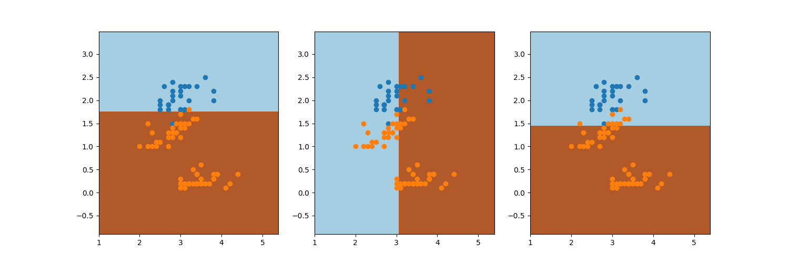
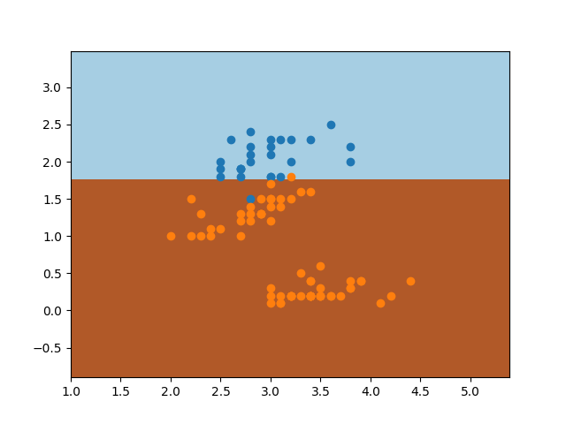

**Adaboost**

Individual classifiers for each iteration of Adaboost for petal width(y-axis) and sepal width(x-axis) is shown here for virginca(blue) and non-virginica(orange) is - 

alpha values are - 1.89, 0.71,0.57
The alpha value of the first classifier is the highest since it is the best classifier.

The final Adaboost classifer obtained is - 

Accuracy = 93%
