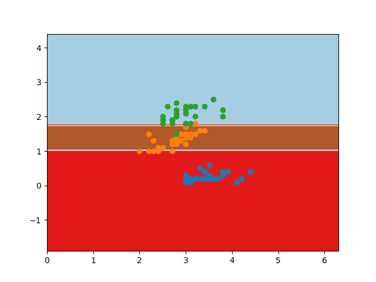

**Random_Forest**

Individual classifiers for each iteration of Random forest for the iris dataset with petal width(y-axis) and sepal width(x-axis) is shown here - The three categories to be identified are IRIS -setosa(blue), virginica(green) and versicolor(orange)

The final RandomForest classifer obtained is - 

Accuracy = 90%
